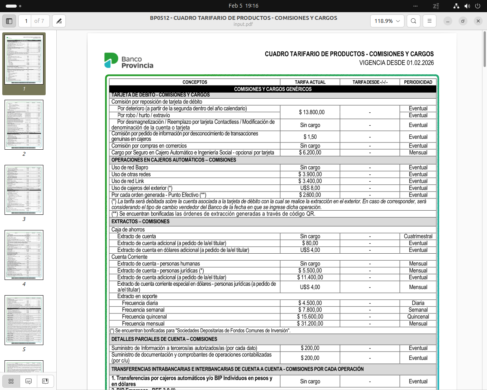
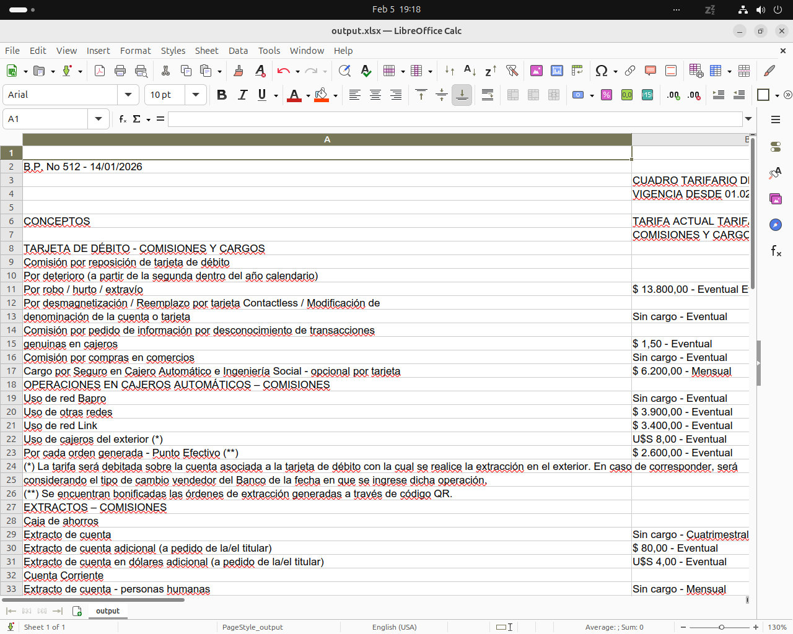

# 📄 Document → Excel / CSV Conversion Toolkit

Convert messy documents and raw text into clean, structured Excel or CSV files using practical, reliable workflows.

This project focuses on **real-world delivery**: taking unstructured data and turning it into spreadsheets that are immediately usable.

---

## 🧩 Text → CSV

Convert messy text files (copied lists, emails, logs, raw text) into clean CSV files.

### Example input

```
John Smith    john@example.com    +1 555-1111
Ana Pérez     ana@acme.com        +54 11 5555-2222
Mike Lee      mike@demo.org       +44 20 7777 8888
```

### Run

```bash
python text_to_csv.py input.txt output.csv --header name,email,phone
```

### Result
A clean CSV file with normalized columns, ready to open in Excel or LibreOffice.

---

## 📄 PDF → Excel

Extract tables from PDF documents and deliver them as clean CSV or Excel files.

On this system, PDF table extraction is performed using **Tabula (Java CLI)** for maximum stability and compatibility.

### Run

```bash
java -jar tabula.jar -o output.csv input.pdf
```

Then open `output.csv` in LibreOffice and **Save As → `.xlsx`**.

### Example

**PDF before conversion**



**Excel after conversion**



### Notes
- Works best with **text-based PDFs** that contain tables
- Scanned or image-only PDFs may require **OCR** before conversion
- Each detected table is exported cleanly and can be formatted further if needed

---

## ⚙️ What this toolkit is useful for

- Converting PDFs into Excel or CSV
- Turning copied or exported text into spreadsheets
- Cleaning and structuring raw data
- Preparing data for reports, analysis, or import into other systems

---

## 📋 Requirements

- Python 3.8+ (for text conversion)
- Java Runtime Environment (for PDF table extraction)
- LibreOffice or Excel for final formatting
